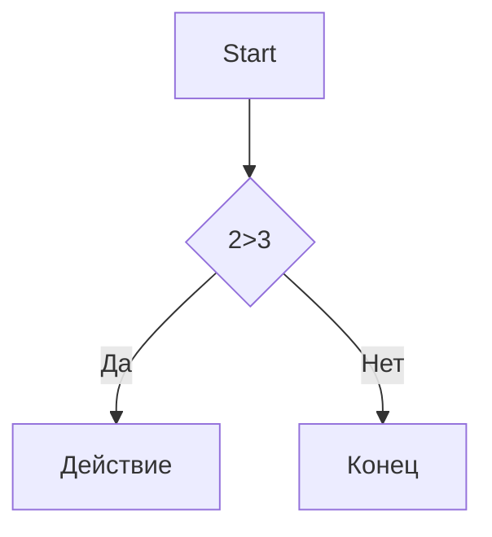

# Dz17.09.2026
## Заголовок 2
### Заголовок 3
#### Заголовок 4
##### Заголовок 5
Выделение текста
----------------

*Курсив* / _Курсив_

**Жирный** / _Жирный_

***Жирный и  курсив*** / ___Жирный и курсив___

~~зачёркнутый~~

~~

`моноширинный код`

Списки
------

-Пункт 1
-Пункт 2
  - Вложенный
  - ещё
1. Первый
2. Второй
3. третий
   1. Вложенный
   2. ещё


- [x] 1
- [ ] 2
- [ ] 3

Ссылки
------

[текст ссылки](https://example.com)

[С подсказкой](https://example.com "При наведении")

<https:/auto-link.com>

[Ссылочный стиль][1]

[1]: https://example.com

Картинки
--------


[](https://i.ytimg.com/vi/J3R3Qto1Jvw/oardefault.jpg?sqp=-oaymwEYCJUDENAFSFqQAgHyq4qpAwcIARUAAIhC&rs=AOn4CLBqcIJkztfWDL2AeSA--D5c9QL_JQ&usqp=CCk)

Цитата
------

 Цитата
 >
 >много строк
 >
 >>Вложенная

Код
---

```markdown
print("Hello") Python
```

```python
c = a+b
print(f"{c} = {a} + {b}")
```

Табилцы
-------
----: = ориентация справа

:---: ориентация по центру

:--- = ориентация слева

| Name | Age | City |
|-----:|:---:|:-----|
|SS    |34   | Mod  |
|SS    |34   | Mod  |
|SS    |34   | Mod  |
|SS    |34   | Mod  |
|SS    |34   | Mod  |

Линии
-----

---
***

___


Экранирование
-------------

\# fdf

\[ dsdsds \]

Диаграмма
---------



Заголовки
---------

- [Заголовки](#1-заголовки)
- [Списки](#3-списки)
  


